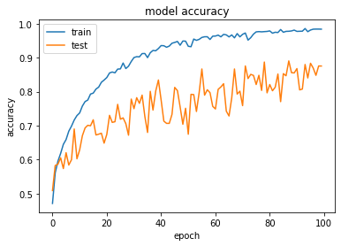

# Skin Lesion Analysis Based On Densely Connected Convolutional Neural Networks

Cancer is one of the deadliest illnesses, which is causing demise for one out of six persons. The possibility of recognizing malignancy at first would help give better treatment and lessen death cases. As innovation is improving continuously, the malignancy can be distinguished utilizing the strategy called DCNN, which is known to be Densely Connected Convolutional Neural Networks.
Here we will identify the disease of the skin by investigating the skin sores. It takes from our base paper known as Skin Lesion Segmentation with Improved Convolutional Neural Networks.Here they have segmented and analyzed only for skin disease Melonama.
In our base paper, they utilized a strategy of CNN. However, we use DCNN as this is profoundly effective in analysing skin lesion. We chose our dataset from Kaggle with 10015 pictures that helps providing efficient analysis in detecting seven kinds of skin diseases.

## Getting Started

### 1. Downloading/Cloning the repo
### Download the repo:
   - Download as a ZIP File:

https://github.com/Eeshapriya/Skin-Lesion-Analysis-Based-On-Densely-Connected-Convolutional-Neural-Networks.zip

### Clone the repo:
   - using CLI:
```
git clone https://github.com/Eeshapriya/Skin-Lesion-Analysis-Based-On-Densely-Connected-Convolutional-Neural-Networks
```
   - using link:
                 
   https://github.com/Eeshapriya/Skin-Lesion-Analysis-Based-On-Densely-Connected-Convolutional-Neural-Networks
   
### 2. Additional requirements
   - [Python](https://www.python.org/) - Programming language used
   - [Kaggle's Notebook](https://kaggle.com/) - Notebook Environment

### 3. Datset
   The dataset used for the training is from [Kaggle](https://www.kaggle.com/) named as [Skin Cancer MNIST: HAM10000](https://www.kaggle.com/kmader/skin-cancer-mnist-ham10000) which was made available by [K Scott Mader](https://www.kaggle.com/kmader) which consists of 10015 dermoscopic images of skin lesions.

## Outputs

### Types of Skin Cancer Lesions


### Final Output Prediction


## Accuracy
### Model Accuracy


### Model Loss


